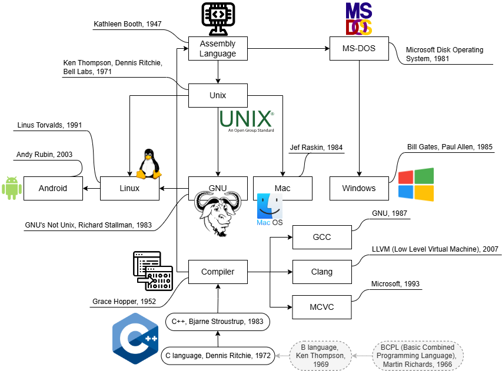

# Install C++ compiler
One figure to explain why a compiler is needed:


## On Linux/WSL
### GCC
GCC (Usually it's pre-installed), just need to check version `gcc --version`

### MinGW-w64
Mingw-w64 is installed on Linux to cross-compile Windows applications, that is, to compile executable files or libraries (.dll) on Linux that can run on Windows.

e.g. in Ubuntu:    
```
sudo apt update
sudo apt install mingw-w64

```
in Fedora/CentOS, use `yum` or `dnf`:
```
sudo yum install mingw64-gcc mingw64-binutils
```
in Arch Linux
```
sudo pacman -S mingw-w64
```
check version for 64-bit and 32-bit:
```
x86_64-w64-mingw32-gcc --version
i686-w64-mingw32-gcc --version
```

compile a c file for 64-bit and 32-bit into executable or libs files:

```
x86_64-w64-mingw32-gcc -o hello.exe hello.c
x86_64-w64-mingw32-gcc -shared -o hello64.dll hello.c

i686-w64-mingw32-gcc -o hello32.exe hello.c
i686-w64-mingw32-gcc -shared -o hello32.dll hello.c
```

## On Windows

### MinGW-w64
[Mingw-w64](https://www.mingw-w64.org/) is an advancement of the original mingw.org project, created to support the GCC compiler on Windows systems.    
Mingw-w64 interacts a lot with other projects in order to help everyone move forward. Contributions have been going to and coming from these projects:    
* [Cygwin](https://cygwin.com/index.html): Get that Linux feeling - on Windows
* ReactOS
* Wine
* [MSYS2](https://www.msys2.org/): Cygwin provides a large collection of packages containing such software, and libraries for their development.

For example, in MSYS2 terminal (after you installed it), install the MinGW-w64 toolchain by running the following command    
```
pacman -S --needed base-devel mingw-w64-ucrt-x86_64-toolchain
```

🫰tips: 
* `pacman` is a package manager (in Arch Linux). Similar to `apt` (in Ubuntu) or `yum` (in CentOS) etc.
* `-S` indicates installation of the specified software package.
* `needed` indicates that only packages that are not currently installed on the system will be installed (installed packages will be skipped).
* `base-devel` a package group that includes basic development tools (such as make, gcc, gdb, etc.).
* `mingw-w64-ucrt-x86_64-toolchain` the toolchain package of Mingw-w64, based on the UCRT runtime library, supporting 64-bit Windows compilation and development.
* `ucrt` (Universal C Runtime) is a modern universal C runtime library on Windows that provides standard library support for C and C++.

After installation, add the path of your MinGW-w64 `bin` folder to the Windows `PATH` environment variable by using the following steps:

1. In the Windows search bar, type **Settings** to open your Windows Settings.    
2. Search for **Edit environment variables for your account**.   
3. In your **User variables**, select the `Path` variable and then select **Edit**.    
4. Select **New** and add the MinGW-w64 destination folder you recorded during the installation process to the list. If you used the default settings above, then this will be the path: `C:\msys64\ucrt64\bin`.    
5. Select **OK**, and then select **OK** again in the **Environment Variables** window to update the `PATH` environment variable. You have to **restart** the computer for the updated `PATH` environment variable to be available.    

Check version
```
gcc --version
g++ --version
gdb --version
```
### MSVS
Microsoft Visual Studio (MSVS) is an integrated development environment (IDE) provided by Microsoft that supports multiple programming languages, including C, C++, C#, Python, etc. Visual Studio uses MSVC (Microsoft Visual C++ Compiler) to compile C and C++ programs. It's very big!


## On MAC (TODO)
I don't have a mac yet.
