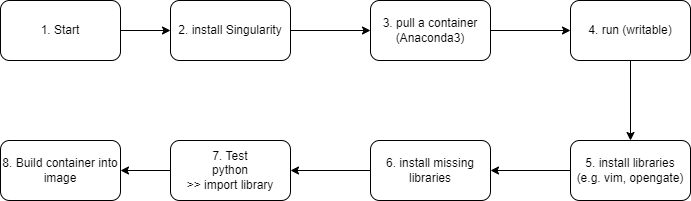

# Install Singularity on WSL

### preface

#### 🧐 What is Singularity
When we do high performance computing (HPC) on cluster, the corresponding running environment should also be uploaded. In the other words, the programs should work in a specific container.
Luckily, Singlularity is just doing this. It's a platform that can load various containers. 
Plus, Singularity is mainly used on Linux system. But personally I prefer to Windows system, in order to run programs on Linux, Windows Subsystem Linux (WSL) is a good choise.

* How to install WSL: See [Official tutorial](https://learn.microsoft.com/en-us/windows/wsl/install#Overview) 

Thus, this note records the installation of Singularity on WSL.


### Installation
* step 1 -> Start: open terminal of WSL
* step 2 -> install Singularity: [official user guide](https://docs.sylabs.io/guides/latest/user-guide/quick_start.html) or more simple one [Tutorial](https://singularity-tutorial.github.io/01-installation/)
    * update packages
    * install Go language
    * install Singularity

### Test
* step 3 -> pull a container: `sudo singularity -d build --sandbox sandbox_anaconda/ docker://bitnami/python:3.9`  
* step 4 -> run: `sudo singularity shell --writable sandbox_gate/`
* step 5 -> install libraries: `apt-get update`; `apt install -y vim`; `pip install opengate`
* step 6 -> install missing libraries e.g. `apt-get update && apt-get install ffmpeg libsm6 libxext6  -y`
* step 7 -> Test: `python`; `import opengate`
* step 8 -> Build the container into image: `sudo singularity build conda_single.sif sandbox_gate/`

⚠️ In step 5, before installing opengate or a library, I create a conda environment via `conda create -n mc python=3.9`, this can prevent from being affected by other complicated settings. To make the `mc` environment as default, change the `~/.bashrc`, add a line `conda activate mc` or `export PATH="/opt/conda/envs/mc/bin:$PATH" `, then `source ~/.bashrc` to make it into effect.

### Usage
* Bind a path:    
`sudo singularity run -B /home2/jzhang/python_code/DeepRT/ conda_single.sif`     
`python3 main.py`

* Alternative way:    
`cd /home2/jzhang/python_code/DeepRT/`    
`singularity exec /home2/jzhang/tensorflow_single.sif bash -c "python3 main.py"`

* with GPU support:    
`srun singularity exec --nv /home/jzhang/image_torch.sif python3 main.py` on cluster

### Singularity container with tensorflow/pytorch GPU

#### Step 0: Make sure `nvidia-smi` worked after installing the NVIDIA GPU driver
   
> Every CUDA toolkit also ships with an NVIDIA display driver package for convenience. This driver supports all the features introduced in that version of the CUDA Toolkit. [Nvidia official guide](https://developer.nvidia.com/cuda-downloads)

#### Step 1: Download container, build it into sandbox
`sudo singularity -d build --sandbox sandbox_tensorflow  docker://tensorflow/tensorflow:tags`    
`sudo singularity -d build --sandbox sandbox_torch  docker://pytorch/pytorch:tags`

👉 Note: the `tags` depends on own requests, see DockerHub:    
[https://hub.docker.com/r/tensorflow/tensorflow/tags](https://hub.docker.com/r/tensorflow/tensorflow/tags)    
[https://hub.docker.com/r/pytorch/pytorch/tags](https://hub.docker.com/r/pytorch/pytorch/tags)    

#### Step 2: Install specific Python libraries in sandbox    
  
`sudo singularity build --sandbox image_name/ image_name.sif` Convert a singularity image to a sandbox folder with superuser privileges       
`sudo singularity shell --writable sandbox_tensorflow/` Shell writable to image_name       
`sudo singularity shell --writable sandbox_torch/`   
   
`pip install libname`    
test:    
`python`   
`import libname`    

👽 a strange finding-> ✨a sandbox is not necessary!
```
singularity run image.sif
pip install libname
```
⚠️ in this case, the libs are installed in local path, e.g. '/home2/jzhang/.local/bin', not in .sif file. 
#### Step 3: Build sandbox into image file     
`sudo singularity build image_tensorflow.sif sandbox_tensorflow/`    
`sudo singularity build image_torch.sif sandbox_torch/`    

#### Step 4: Run python file in image file
* on the cluster
`srun singularity exec --nv /home/jzhang/image_tensorflow.sif python3 test.py`  [shell example](/docs/SLURM.md), run `sbatch test.sh`      
* on the local machine 
`sudo singularity exec --nv /home/jzhang/image_torch.sif python3 test.py`    

test.py
```
# import torch

# print(torch.__version__)
# print(torch.cuda.is_available())
# print(torch.cuda.device_count())
# print(torch.cuda.device(0))
# print(torch.cuda.current_device())
# print(torch.cuda.get_device_name(0))

import tensorflow as tf 

print(tf.__version__)
print(tf.test.is_gpu_available())
print(tf.config.list_physical_devices('GPU'))    
```
#### Reference
  * [Singularity 容器使用介绍](https://www.xiexianbin.cn/hpc/singularity/index.html)
  * [Singularity实践教程 + Docker 转 Singularity 的避坑指南](https://blog.csdn.net/Tanqy1997/article/details/125304273)
  * [anaconda设置默认的启动环境](https://blog.csdn.net/weixin_40548136/article/details/106331324)
  * [Docker Image Anaconda3](https://hub.docker.com/r/continuumio/anaconda3)
  * [missing libraries when installing opengate](https://stackoverflow.com/questions/55313610/importerror-libgl-so-1-cannot-open-shared-object-file-no-such-file-or-directo)
