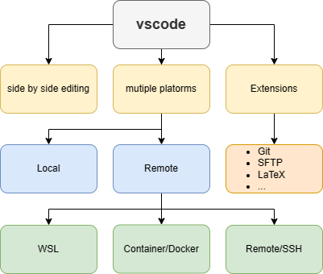
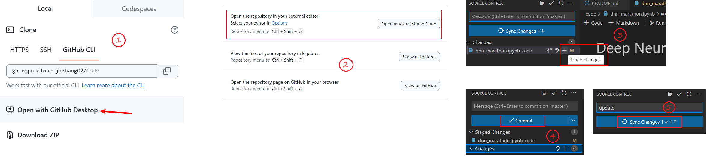

# Play with VSCode

Suppose the VSCode is intalled under Windows OS, then VSCode can do many things:
* Side by side editing any files, such as .py, .md, etc.
* Multiple platforms or extensions, based on personal requirements:
  * Local code developing
  * WSL
  * Remote SSH connecting
  * Container/Docker
* Extensions:    
  * Git, synchronize the code to GitHub.
  * SFTP or upload, uploading or downloading files from remote.
  * PDF Viewer.
  * Tree Exporter, export the directory structure of your project as a text-based tree.
  * LaTex, writing tex file.
  * plenty of extensions...

An example of Git and VSCode linkage:    
1. Open one of your repos in GitHub by GitHub Desktop;
2. Then open the repo and edit your code in the VSCode;
3. Stage changes;
4. Commit changes;
5. Synchronize to GitHub.

😲😲😲
You can also play with **[Codespaces](https://docs.github.com/en/codespaces/overview)**

