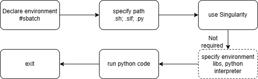

# Usage of SLURM

### Concepte
> The Slurm Workload Manager, formerly known as Simple Linux Utility for Resource Management, or simply Slurm, is a free and open-source job scheduler for Linux and Unix-like kernels, used by many of the world's supercomputers and computer clusters. --Wikipedia

Suppose that an institue has already a cluster. They deploy SLURM to manage different user's jobs.
This note reveals very basic usage of shell script based on SLURM.

### Common commands on cluster
* `sinfo` see the cluster information
* `squeue -u username` see the jobs under a user
* `squeue -l` see the jobs
* `squeue --start` see the waiting jobs
* `scontrol show nodename` or `scontrol show job name` show info of nodes or jobs
* `scontrol show node` show info of all nodes
* `scancel jobid` cancel a job
* `scancel -u username` cancel all jobs with a user
* `scancel -u username -p partition` cancel jobs witha a user under certain partition
* `sacct -j ID-number` the state of a job,  four states: Pending; Running; Completed;Failed
* `htop` see CPU info    
* `nvidia-smi` see GPU info
* `watch squeue -u user` watch jobs

### Usage of shell file
🔸detailed version:

`#!/bin/bash` tell computer to use which shell    
`#SBATCH --partition=partition1,partition2,partition3...` select partitions based on available partitions, comma, no space  
`#SBATCH --gres=gpu:2` specify the gpu if has and the number of gpu    
`#SBATCH --cpus-per-task=16` the number of cpus each task   
⚠️if `cpus-per-taks` are too many, one may not fully utilize all nodes if one submit a lot of jobs    
`#SBATCH --ntasks=1` specify the number of tasks to run   
`#SBATCH --job-name=anyname` the job name    
`#SBATCH --mem-per-cpu=1500MB` the memory of each cpu    
`#SBATCH --mem=50GB` the memory of global cpus, e.g. if use 16 cpus, then the total memory of those cpus is 50GB    
`#SBATCH --array=0-4` specify job array, e.g. from 0 to 4, 5 jobs  
`#SBATCH --out=absolute path/sim_result.txt` output results  
`#SBATCH --out=absolute path/sim_result_%a.txt` output different jobs' results    
`#SBATCH --error=error_%j.txt`    output error results      
`#SBATCH --nodelist cn447` specify node    

🔸simple version:    

`#!/bin/bash`   
`#SBATCH -p partition1,partition2,partition3...`    
`#SBATCH -c 1`    
`#SBATCH -n 1`     
`#SBATCH -j anyname`    
`#SBATCH -a 1-4`     
`#SBATCH -o absolute path/sim_result.txt`    
`#SBATCH -o absolute path/sim_result_%a.txt`    

Workflow of prepareing a shell script based on SLURM:


* **Case 1: submit a single job**

🐚 in shell (pytest.sh):

```
#!/bin/bash
#SBATCH --partition=partition1,partition2,partition3
#SBATCH --cpus-per-task=1
#SBATCH --ntasks=1
#SBATCH --job-name=myjob
#SBATCH --out=result.txt

cd  /path of python code

singularity exec /absolute path of .sif file/container.sif bash -c "source $HOME/set_environment.sh && python test.py"

echo "   "
echo "Finished."
exit
```
👉 in command line `sbatch pytest.sh`

* **Case 2: submit mutiple jobs**

📜 in python code (test.py):

```
import sys

...

# each job correponding to a specific data with passed arguement from shell
filename = 'data_'+str(sys.argv[1])+'.suffix'

print(f"{filename} is being processed...")

dataload(/path/filename)

...

```

🐚 in shell (pytestmulti.sh):

```
#!/bin/bash
#SBATCH -p partition1,partition2,partition3
#SBATCH -c 1
#SBATCH -n 1
#SBATCH -j myjob
#SBATCH -a 1-4
#SBATCH -o /path/result_%a.txt

cd  /path of python code

echo "My SLURM_ARRAY_TASK_ID: " $SLURM_ARRAY_TASK_ID
start=$(date +%s)

singularity run /absolute path/container.sif bash -c "source $HOME/set_environment.sh&& python test.py $SLURM_ARRAY_TASK_ID"

end=$(date +%s)
secs=$((end - start))
printf 'This program takes %dd:%dh:%dm:%ds\n' $((secs/86400)) $((secs%86400/3600)) $((secs%3600/60)) \ $((secs%60))
echo "   "
echo "Finished."
exit
```
👉 in command line `sbatch pytestmulti.sh`

* **Case 3: save results**

The results can be saved in the folder of jobid, so the jobid should be passed in to the python code.

📜 in python code (test.py)
```
...

jobid = str(sys.argv[1])
best_model = jobid + '/torch/best_model.pth'

...

```
🐚 in shell (deeptorchdir.sh)

```
#!/bin/bash 

#SBATCH --partition=a6000,titanGPU
#SBATCH --gres=gpu
#SBATCH --cpus-per-task=6
#SBATCH --ntasks 1
##SBATCH --mem-per-cpu=1500MB
#SBATCH -J LUDL
#SBATCH --out=/home2/jzhang/python_code/clusterlogs/%J-result.txt
#SBATCH --error=/home2/jzhang/python_code/clusterlogs/%J-error.txt

# Move files to target directory
mkdir $SLURM_SUBMIT_DIR/$SLURM_JOB_ID
cp -r /home2/jzhang/python_code/DeepRT/04pretherapy/torch/ $SLURM_SUBMIT_DIR/$SLURM_JOB_ID
# Run
cd $SLURM_SUBMIT_DIR/$SLURM_JOB_ID
echo Working directory : $PWD
echo "Start running..."
start=$(date +%s)
srun singularity exec --nv /home2/jzhang/image_torch.sif python3 $PWD/torch/train.py $SLURM_SUBMIT_DIR/$SLURM_JOB_ID
end=$(date +%s)
secs=$((end - start))
printf 'This program takes %dd:%dh:%dm:%ds\n' $((secs/86400)) $((secs%86400/3600)) $((secs%3600/60)) \ $((secs%60))
echo " "
echo `date "+%Y-%m-%d %H:%M:%S"`  
exit
```

👉 in command line `sbatch deeptorchdir.sh`


### Reference
* [sbatch in SLURM](https://slurm.schedmd.com/sbatch.html)
